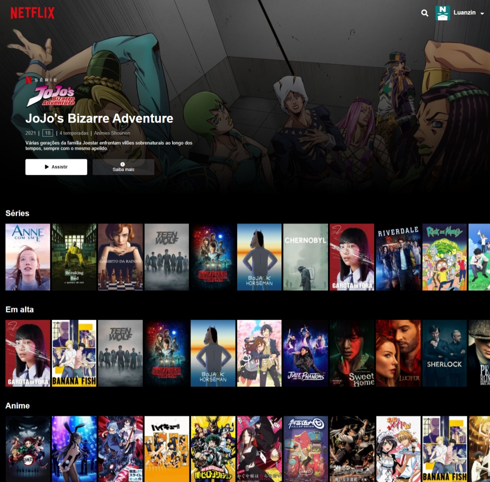

# Clone de Interface Netflix

### Para computador fica assim:

### Em celular o layout muda assim:

### ***Desenvolvido com base no projeto do professor [Felipe Silva](https://github.com/felipeAguiarCode) da DIO***

***Descrição do projeto:***
>Ultilizei as tecnologias html, css e o jquery. Pegamos do jquery o owl carrousel, que nos apoiou com o desenvolvimento do catálogo de séries e animes.
Ele também proporcionou um desafio de adicionar mais elementos a nossa interface e eu fiz como desejado. Adicionei o fundo de JoJo que é um anime que adoroo!! Além de colocar a 
imagenzinha de perfil em cima e alguns retoques para ficar mais pareceido com a Netflix.

[Veja a interface clicando aqui](https://luanthierry.github.io/Interface_Netflix/)
